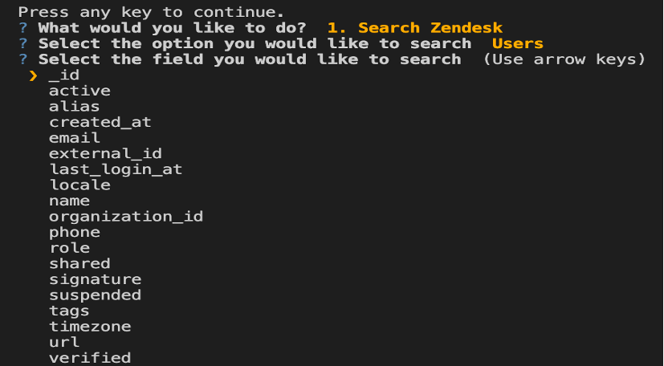
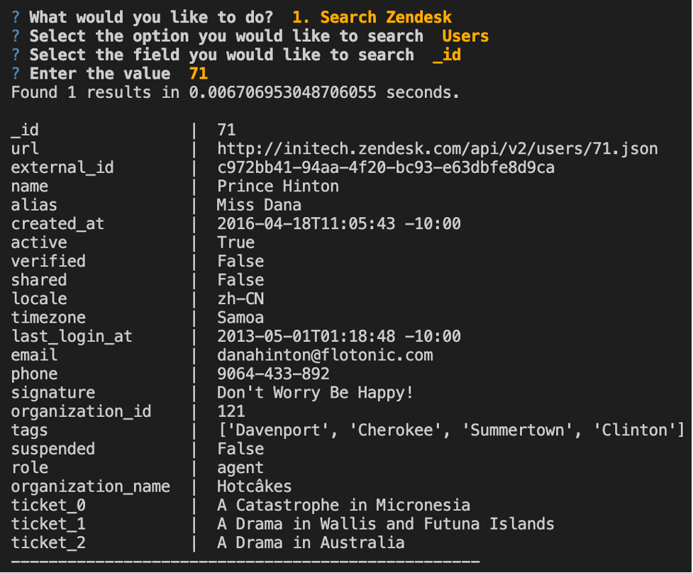
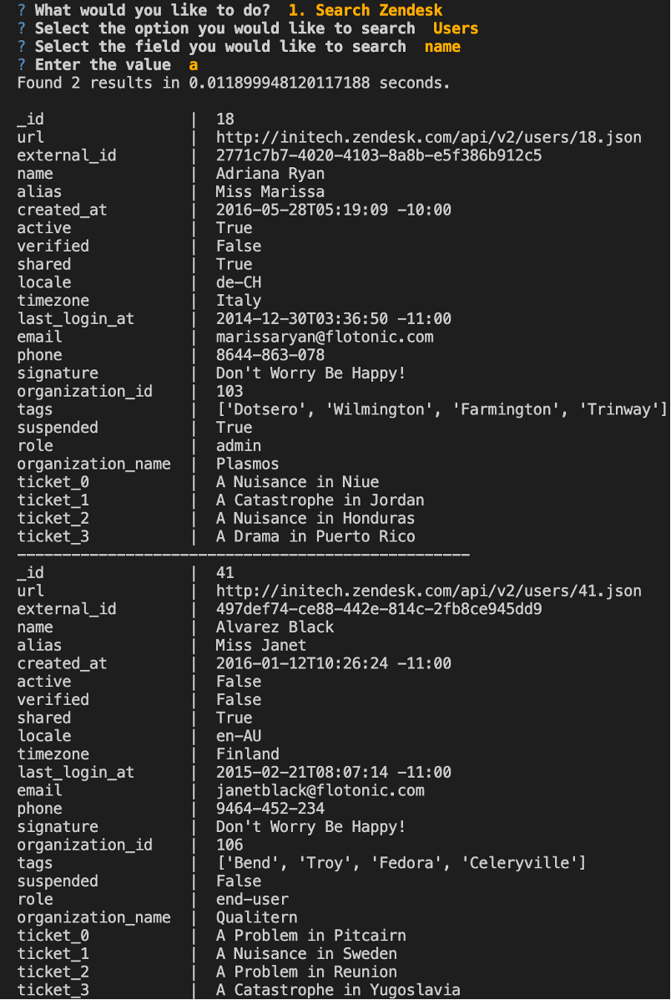

<!--
*** Thanks for checking out the Best-README-Template. If you have a suggestion
*** that would make this better, please fork the repo and create a pull request
*** or simply open an issue with the tag "enhancement".
*** Thanks again! Now go create something AMAZING! :D
***
***
***
*** To avoid retyping too much info. Do a search and replace for the following:
*** github_username, repo_name, twitter_handle, email, project_title, project_description
-->


<!-- PROJECT SHIELDS -->
<!--
*** I'm using markdown "reference style" links for readability.
*** Reference links are enclosed in brackets [ ] instead of parentheses ( ).
*** See the bottom of this document for the declaration of the reference variables
*** for contributors-url, forks-url, etc. This is an optional, concise syntax you may use.
*** https://www.markdownguide.org/basic-syntax/#reference-style-links
-->

<!-- PROJECT LOGO -->
<br />
<p align="center">

  <h2 align="center">Zendesk Challenge</h2>

  <p align="center">
    A minimal application to query data through an interactive command line shell. The application facilitates searching for records by user, tickets or organisation. Search can be performed by utilising any available fields from the three criteria.
    
<br />
  </p>
</p>


<!-- TABLE OF CONTENTS -->
<details open="open">
  <summary><h2 style="display: inline-block">Table of Contents</h2></summary>
  <ol>
    <li>
      <a href="#about-the-project">About The Project</a>
      <ul>
        <li><a href="#built-with">Built With</a></li>
      </ul>
    </li>
    <li>
      <a href="#getting-started">Getting Started</a>
      <ul>
        <li><a href="#prerequisites">Prerequisites</a></li>
        <li><a href="#installation">Installation</a></li>
      </ul>
    </li>
    <li><a href="#usage">Usage</a></li>
    <li><a href="#contact">Contact</a></li>
    <li><a href="#acknowledgements">Acknowledgements</a></li>
  </ol>
</details>


<!-- ABOUT THE PROJECT -->
## About The Project

A minimal application to query data through an interactive command line shell. The application facilitates searching for records by user, tickets or organisation. Search can be performed by utilising any available fields from the three criteria with either exact-match or near-match. It will also validate the inputs given and provide appropriate message for the valid input. When you search by any one category, you will be provided with the list of search terms that can be used in that category for searching. 

Some points to note:
- The database loads the data from three given json files into ZENDESK-CHALLEGE/app/data/zendesk.json
- Only one key can be selected for search
- All the terms for a specific table will be displayed to choose from instead of asking as an input to avoid human errors and make it more intuitive 
- You can also look for empty fields in the database
- If you only know the starting alphabet for a value, it will give back results all the results that starts with it. 
- Inputs will be validated at every step


### Built With

* [Python](https://www.python.org/)
* [PyInquirer](https://github.com/CITGuru/PyInquirer)
* [TinyDB](https://github.com/msiemens/tinydb)


<!-- GETTING STARTED -->
## Getting Started

1. Clone the repo
2. python -m venv venv && source venv/bin/activate
3. pip install -r requirements.txt 
4. Launch the shell by running the command - python main.py

**A shell should prompt with the below welcome message**


<!-- USAGE EXAMPLES -->
## Usage

Use **up/down** arrow to select preferred choice to use the search.


**Option 1**: Search Zendesk





**Option 2**: See a list of all searchable field


**Additional Usage**
*Near match* - application can return results for search fields even if exact value is not provided



*Search value validation* - Application makes sure that the entered value for the search fields is in appropriate format, else valid error messages are returned


### Project Structure
```
ZENDESK-CHALLEGE
 ┣ app
    ┣ controller
    ┃ ┣ listFields.py
    ┃ ┗ search.py
    ┣ data
    ┃ ┣ organizations.json
    ┃ ┣ tickets.json
    ┃ ┗ users.json
    ┣ model
    ┃ ┗ db.py
    ┣ view
    ┃ ┗ zendeskPrompts.py
 ┣ tests
 ┣ main.py
 ┣ README.md
 ┣ requirements.txt 
 ```

<!-- CONTACT -->
## Contact

Harshit Sethi - [Personal Website](www.harshitsethi.com) - hsethi2709@gmail.com


<!-- ACKNOWLEDGEMENTS -->
## Acknowledgements

* [Zendesk](https://www.zendesk.com)
